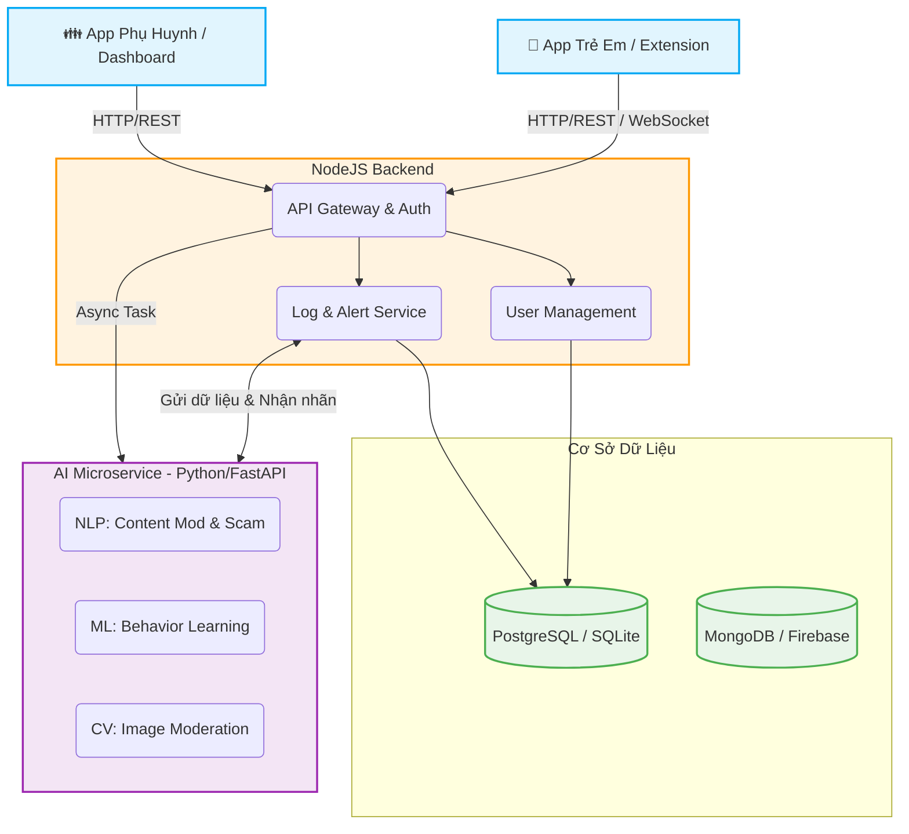

# 🛡️ Hệ Thống "Lá Chắn Số" - Nền Tảng Bảo Vệ Gia Đình Trên Không Gian Mạng

Dưới đây là tài liệu thiết kế hệ thống chi tiết cho dự án "Lá Chắn Số", kèm theo phân tích luồng hoạt động chuyên sâu và định hướng huấn luyện AI, được biên soạn phù hợp cho sinh viên CNTT làm đồ án hoặc bài tập lớn.

---

## 1. 🔄 Kiến Trúc Hệ Thống Chi Tiết

Hệ thống được thiết kế theo mô hình **Microservices** hoặc **Service-oriented Architecture (SOA)**, tách biệt các khối xử lý để dễ dàng mở rộng và bảo trì.

### Các Thành Phần Cốt Lõi:
1. **Frontend (ReactJS/Vite)**: Giao diện trực quan (Dashboard) cho phép phụ huynh theo dõi. Dễ sử dụng, hiển thị biểu đồ và nhận cảnh báo realtime.
2. **Backend (NodeJS/Express)**: Máy chủ trung tâm lưu trữ dữ liệu người dùng, Logs hoạt động và Alerts cảnh báo. 
3. **AI Service (Python/FastAPI)**: Một Microservice độc lập chuyên chạy các Model AI nặng. Có endpoint riêng biệt để phân tích text (`/ai/check-text`) và link (`/ai/check-link`).
4. **Database (SQLite/MongoDB)**: Lưu trữ lịch sử duyệt web để phân tích hành vi dùng thiết bị.

---

## 2. 🚦 Luồng Hoạt Động (Demo Flow)

### Luồng 1: Giám sát nội dung văn bản (Tin nhắn / Trạng thái trên mxh)

- **Bước 1**: Trẻ vào một diễn đàn, vô tình chuẩn bị gửi hoặc nhận một tin nhắn có chứa từ "nhấp vào đây để trúng thưởng gửi tiền..."
- **Bước 2**: "Lá Chắn Số" Extension (hoặc App) chạy ngầm bắt được đoạn text này, gọi API lên Backend NodeJS.
- **Bước 3**: Backend định tuyến đoạn text qua **AI Microservice** (FastAPI) để xử lý.
- **Bước 4**: Model AI `DistilBERT` phân tích câu. Nhận thấy pattern lừa đảo, API trả về `{"riskLevel": "high", "label": "Scam", "confidence": 0.95}`.
- **Bước 5**: Backend lưu `Alert` (Cảnh báo) với nguy cơ cao vào CSDL. 
- **Bước 6**: Lập tức gửi Notification/Realtime Socket tới Frontend Dashboard của phụ huynh. Giao diện báo đỏ 🚨.

### Luồng 2: Phát hiện bất thường từ thói quen

- **Mô tả**: Thông thường bé chỉ dùng điện thoại từ 19h - 21h vào Youtube. Hôm nay lúc 2h sáng bé vào trang lạ duyệt.
- AI **Behavior Learning** sẽ xử lý dữ liệu log định kỳ (Cronjob báo cáo cuối ngày) bằng Isolation Forest (Anomaly Detection), sinh ra báo cáo "Truy cập khung giờ bất thường" cho ngày hôm sau.

---

## 3. 📚 Gợi Ý Dataset Để Cải Tiến AI (Dành cho Sinh Viên)

Để "Lá Chắn Số" không chỉ là mock project mà có model thực sự hoạt động, bạn có thể tự train AI dựa trên các bộ Dataset mở sau đây:

### A. AI Lọc Nội Dung Độc Hại & Bạo Lực (Content Moderation)
- **Tiếng Anh**: 
  - `Jigsaw Toxic Comment Classification Challenge` (Kaggle): Chứa bình luận với nhãn toxic, severe_toxic, obscene, threat.
- **Tiếng Việt**: 
  - VietNLP Toolkit Dataset.
  - Tự crawl thu thập data bình luận rác trên Facebook/Tiktok/Youtube và tự label (tầm 2,000 dòng là train tốt với pre-trained model như `PhoBERT`).

### B. AI Phát Hiện Lừa Đảo (Phishing/Scam link & text)
- **Phishing URL Dataset**:
  - `Phishing Site URLs` trên Kaggle (chứa hơn 500,000 link hợp lệ và link lừa đảo).
- **Spam / Sms Scam**:
  - `SMS Spam Collection Dataset` (Kaggle).

### C. AI Hình Ảnh (Image Moderation)
- **Dataset**: `NSFW Data Scraper` (Nội dung người lớn/bạo lực) hoặc sử dụng API có sẵn (Google Cloud Vision API/ AWS Rekognition) thay vì tự train để tiết kiệm tài nguyên và bảo toàn độ chính xác.

---

## 4. 🚀 Lời Khuyên Triển Khai Thực Tế

> [!TIP]
> Bạn đã có code mẫu (Frontend + NodeJS Backend + FastAPI) trong thư mục dự án. Để chạy và test mô hình này:

1. **Khởi động Backend (Port 3000)**: 
   Sử dụng lệnh `node server.js` ở thư mục `backend`.
2. **Khởi động AI (Port 8000)**:
   Cài đặt `pip install fastapi uvicorn`, sau đó dùng `uvicorn main:app --reload` ở thư mục `ai-service`.
3. **Khởi động Frontend (Port 5173)**:
   Dùng `npm run dev` ở thư mục `frontend`.

Từ tab **Mô phỏng hành vi của trẻ (Chat/Search)** trên Frontend, hãy thử gõ một vài câu như *"chuyển tiền gấp cho số tài khoản này"* hoặc *"mày muốn đánh nhau không"*. AI Service sẽ lập tức bắt lỗi, backend sinh ra cảnh báo và giao diện phụ huynh sẽ hiện lịch sử tương tác nguy hiểm.
